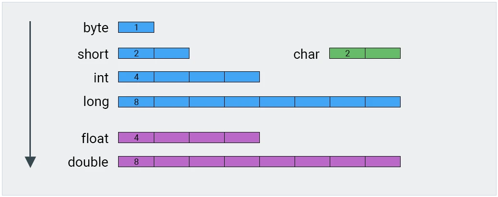

# Типы данных

### Примитивные типы данных

 (1).png>)

Числовые значения типа _**long**_ указываются с префиксом _**L**_ (4587L).

Числовые значения типа _**floan**_ указываются с префиксом _**F**_ (235.367F).



### Ссылочные типы данных

В ссылочные типы входят все классы, интерфейсы, массивы.

#### Классы оболочки

* Byte
* Short
* Integer
* Long
* Float
* Double
* Character
* Boolean

#### Тип String

String предназначен для хранения строк текста.

```java
//Создание строки с помощью конструктора 
String myString = new String("The weather was fine");

//Можно также создать строку используя кавычки ""
String myString = "The weather was fine";
```

#### Перечисляемый тип

Перечисляемый тип имеет конечный набор именованных значений.

```java
enum Size {SMALL, MEDIUM, LARGE, EXTRA_LARGE};
Size size = Size.MEDIUM;
```
